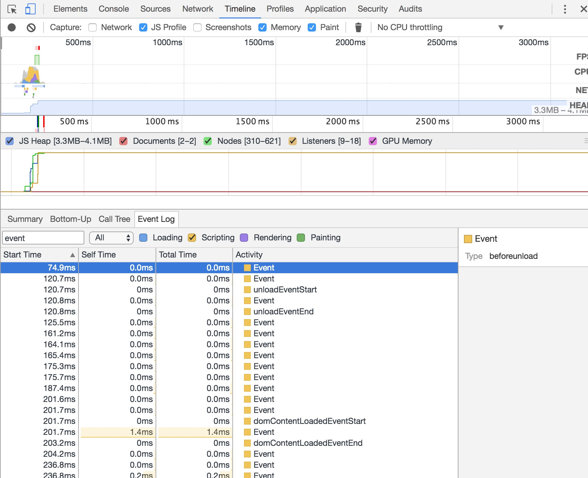

# 从 chrome TimeLine 认识页面的生命周期

##获取步骤：
1.打开chrome inpesctor
2.打开 Timeline 
3.刷新页面
图如下：

## 周期开始
	* beforeunload  卸载当前页面之前
	* pagehide		隐藏页面
	* unload		卸载页面
	* readystatechange	状态改变
	* load              
	* DOMContentLoaded  dom 解析完毕
	* pageshow		页面展示

